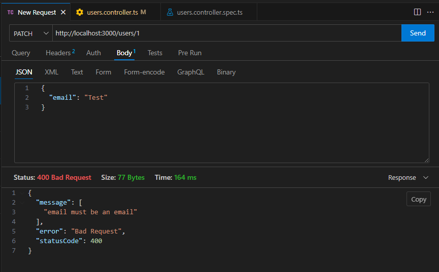
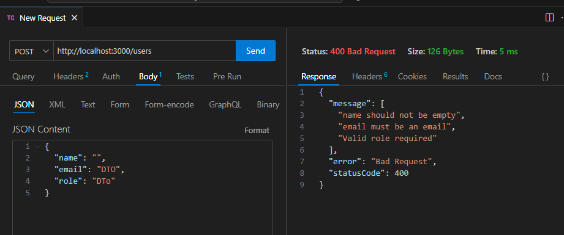
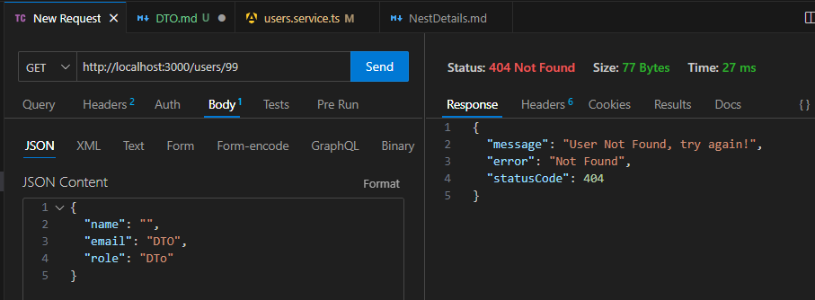
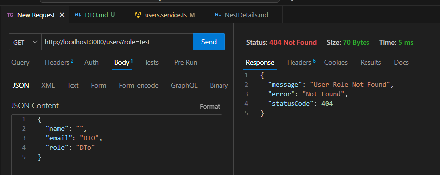

### DTO (Data Transfer Object)

A DTO (Data Transfer Object) is an object used to transfer data between different layers of an application, such as from the backend to the frontend or between microservices.

## ParseIntPipe 

- Ensures Numeric Input – Converts a string to an integer.
- Avoids Unexpected Errors – Prevents invalid values from being processed.
- Throws an Error for Invalid Numbers – If the input is not a valid number, NestJS will return a BadRequestException.

## ValidationPipe 
- Automatic Validation – Checks DTO fields automatically.
- Prevents Invalid Data – Rejects requests with incorrect data types.
- Provides Clear Error Messages – Returns detailed validation errors.
- Strips Unwanted Properties – Prevents extra data from being processed.
- Transforms Input Data – Converts string numbers to actual numbers.

## NotFoundException
- NotFoundException is a built-in NestJS exception that returns 404 Not Found.
- Can be used in controllers or services to handle missing data.
- Supports custom error messages and custom objects.
- Can be customized further using Exception Filters.

NPM Lists:
//npm i @nestjs/mapped-types -D
//npm install class-validator class-transformer